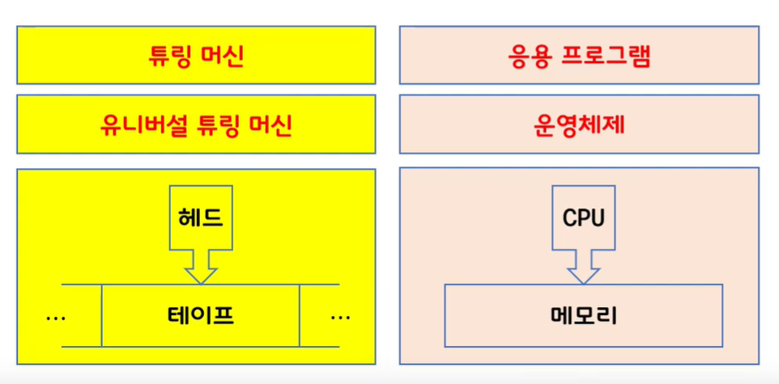
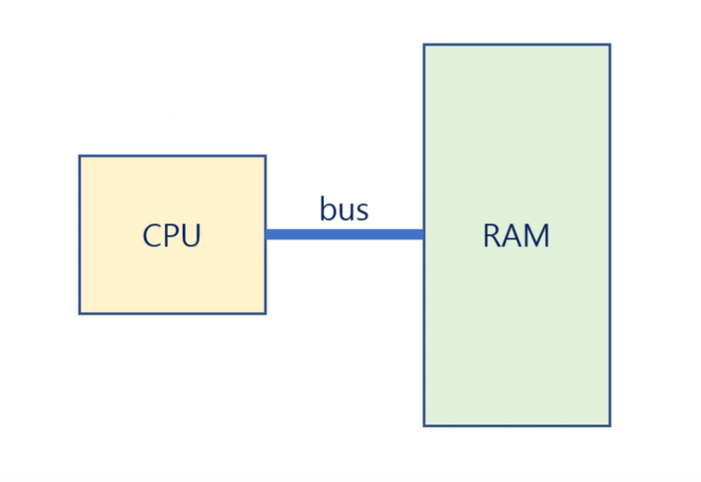

# 1. 운영체제가 뭐길래

- Operating System

  - a software that operates a computer system

- Computer

  - A machine that proccesses the informatin

- Information

  - Cladue Shannen

    - $$
      I(X) = - log_2{P(X)}
      $$

    - 정보의 양은 해당 정보의 확률의 로그를 취한것의 마이너스이다.

    - 정보 하나의 단위는 `1bit`이다.

  - A quantitative representation that measures the uncertainty

- 컴퓨터가 정보를 처리하는 법

  - 정보의 최소 단위 : bit(binary digit)
    - 8 bit = 1byte
  - 정보의 처리 : 정보의 상태 변환 (0에서 1로, 1에서 0으로)
  - 부울 대수(Boolean Algebra) : NOT, AND, OR
  - 논리 게이트 : NOT, AND, OR, XOR, NAND, NOR
  - 논리 회로 : IC,LSI,VLSI,ULSI,SoC...
    - 무어의 법칙, 황의 법칙
  - 정보의 저장과 전송 : 플립 - 플롭, 데이터 버스
  - 범용성 : universality
    - NOT,AND,OR 게이트 만으로 모든 계산을 할 수 있다.
    - NAND 게이트만으로 모든 계산을 할 수 있다.
    - 범용 컴퓨터 : general - purpose computer
  - 계산 가능성 : computability
    - Turing-computable : 튜링 머신으로 계산 가능한 것
    - 정지 문제 : Halting Problem : 튜링머신으로 풀수 없는 문제

- 튜링머신

  

  - 컴퓨터의 구조와 튜링 머신의 구조가 비슷하다.

- 폰 노이만

  - A stored - program computer is
    - a computer that stores programs in memory

  

  - Instruction Set Architecture라 부른다

- 프로그램 

  - A program is a set of instructions
    - that tells a computer's hardware to perform a task	

- 운영체제

  - Operating System
    - is a program running at all times on the computer
    - to provide system services to application programs
    - to manage processes, resources, user interfaces and so on