## 운영체제 : 02 운영체제의 개념과 구조

- Comupter System

  - the hardware
  - the operating system
  - the application programs
  - user

  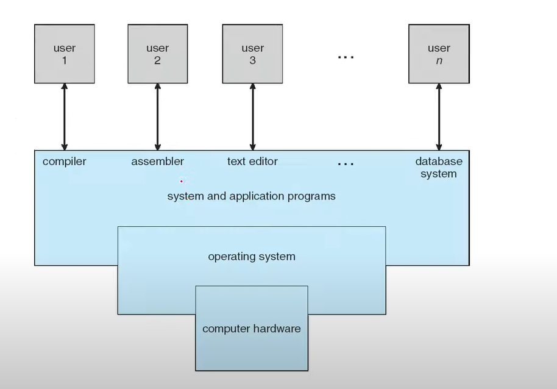

운영체제의 정의

- There are No universally accepted definition of an operating system
- A more common definition is that
  - the one program running at all times on the computer
    - 운영체제는 컴퓨터에서 항상 돌아가는 프로그램이라고 정의한다.
  - usallay called the **kernel**
- kerneal에서 제공하는 프로그램
  - system programs
  - application programs

컴퓨터의 기본적인 구조 (classical computer system)

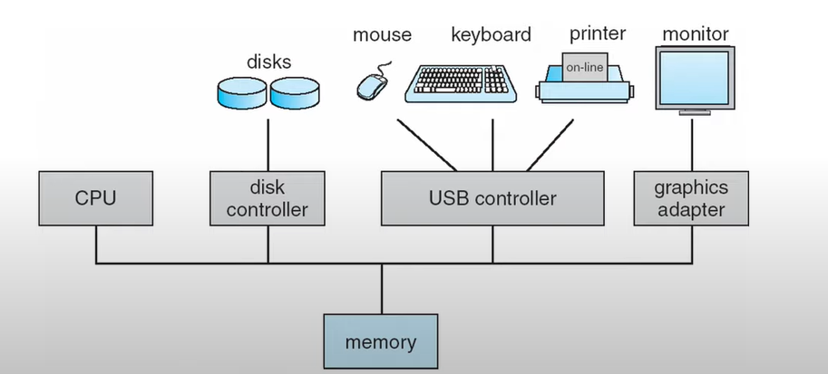

- one or more CPUs  and
- a number of device controllers connected through a common **bus**

부트스트랩 프로그램 (bootstrap program)

- 컴퓨터가 켜졌을때 가장 처음에 실행되어야하는 프로그램
  - 운영체제를 로딩하는 일 
  - 하드에 있는 운영체제를 메모리에 로딩해주는 일

인터럽트 (Interrupts)

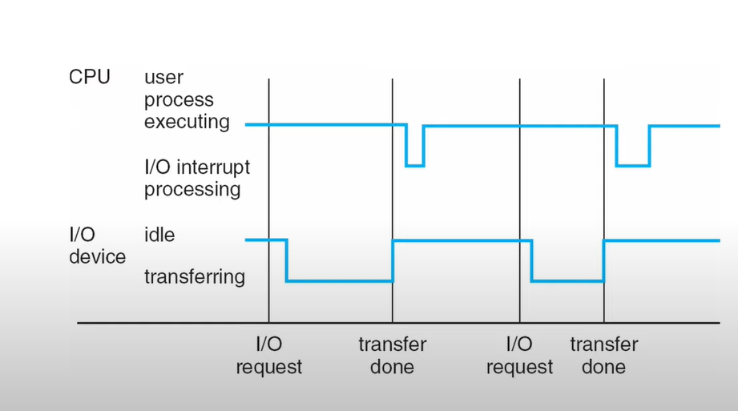

- I/O device가 CPU에 신호를 보내는 트리거
- Hardware may trigger an intterupt at any time
  - 시스템 버스를 통해, 시그널을 CPU에 보낸다.

폰 노이만 아키텍쳐

- 산술 논리 장치와 프로세서 레지스터를 포함하는 처리 장치
- 명령 레지스터와 프로그램 카운터를 포함하는 컨트롤 유닛
- 데이터와 명령어를 저장하는 메모리
- 외부 대용량 스토리지
- 입출력 매커니즘
- A typical instruction - execution cycle
  - first fetches an instruction from memory
  - and stores that instruction in **instruction register**
    - 명령어 레지스터가 있어서, 명령어를 fetch를 하고 execute를 해주는 방식을 폰 노이만 구조라 한다.
- The instruction is the decoded
  - and may cause operands to be fetched from memory
  - and stored in some internal register
- After the instruction on the operands 
  - has been executed
  - the result may be stored back in memory

- Storage System의 계층 구조

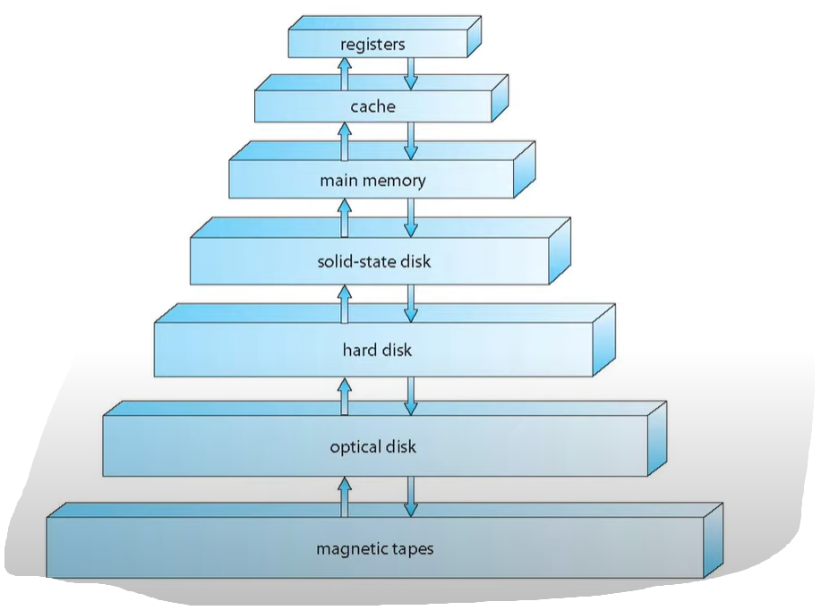

- ​	
  - register : CPU 내에 있는 저장장치
  - cache : register와 main memory사이에 있다. 메모리보다 빠르다.
  - main memory : 우리가 흔히 말하는 램
  - solid - state dist : 메모리 형태의 하드디스크
  - hard dist : HDD

- I/O Structure

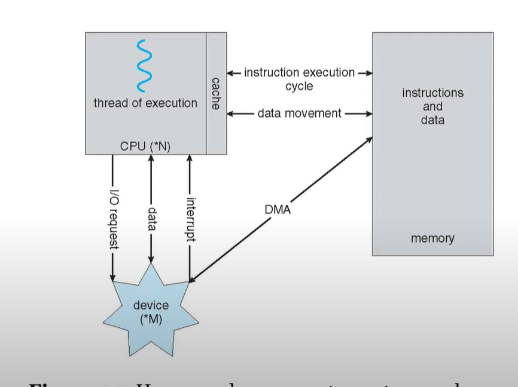

- DMA : Direct memory access
- A large portion of OS code is dedicated to managing I/O

- 컴퓨터 시스템 컴포넌트의 정의

  - CPU : The hardware that executes instructions
  - Processor : A physical chip that contains one or more CPUs
  - Core : The back computation unit of the CPU
  - MultiCore : Including multiple computing cores on the same CPU

- Symmetric multiprocessing(SMP)

  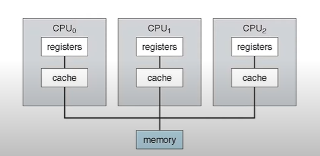

  - 둘 이상의 동일한 프로세서가 단일 공유 [주 메모리](https://en.wikipedia.org/wiki/Main_memory) 에 연결되고 모든 I / O 장치에 대한 전체 액세스 권한을 가지며 처리하는 단일 운영 체제 인스턴스에 의해 제어되는 [다중 프로세서](https://en.wikipedia.org/wiki/Multiprocessor) 컴퓨터 하드웨어 및 소프트웨어 아키텍처

- Multi Core design

  - 같은 프로세서에 여러개의 core로 나눈게 멀티 코어 디자인이다.

    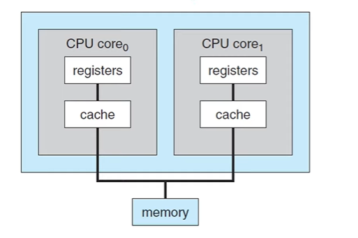

- multiprogramming
  - 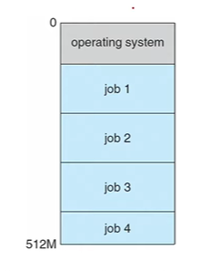
  - 여러개의 프로그램을 동시에 메모리에 올려놓고 실행하는 것
  - keeps several proccesses in memory simulaneously
  - to increase CPU utilization( CPU의 사용율을 높여줌)

- Multitasking(멀티프로세싱) : concurrency(pallerelism과 차이를 알아야한다.)
  - a logical extension of multiprogramming
    - CPU가 여러개의 작업을 자주 바꾸면서 여러개의 프로그램을 동시에 돌아가는 것처럼  사용자가 느낄수 있게 된다.
  - CPU scheduling : (CPU 스케쥴링이 중요)
    - 만약에 같은 시간에 여러개의 프로세스가 실행이 되었을때, 시스템은 무조건 그 프로세스 중에서 다음에 실행될것을 결정해줘야한다.

- Two separate mode of operations

  - **user mode** and **kernel mode**

    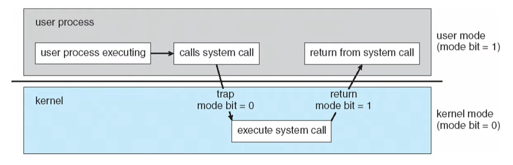

  - 프로그램의 잘못된 행동을 예방해주기 위해, 커널모드와 유저모드가 있다.

  - 그러므로, 컴퓨터에 직접적인 제어는 커널모드에서만 가능하고, 유저모드에서는 동작이 불가능하게 했다.

- Virtualization (가상화)
  - technology that allow us
    - to abstract the hardware of single computer
    - into several diffrent execution enviroments
    - 한 컴퓨터에서 다양한 OS를 실행
    - 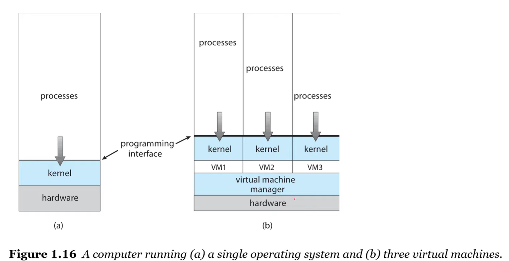

- OS의 제공하는 환경

  - User interface
  - Program execution
  - I/O operation
  - File system manipulation
  - Communications
  - Error detection
  - Resource allocation
  - Logging
  - Protection and security

  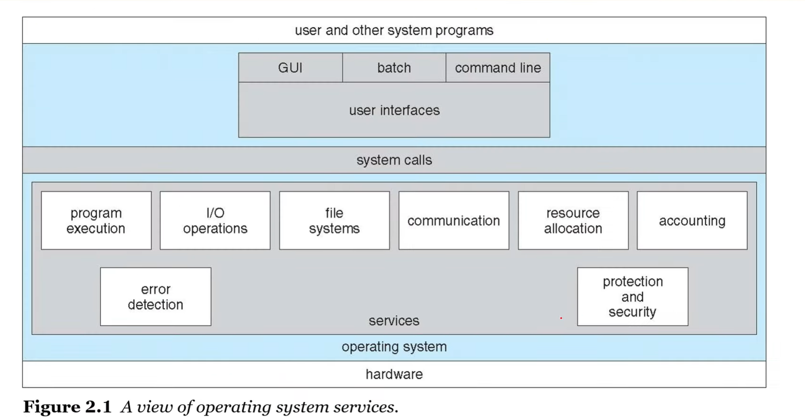

- System call

  - provide an interface to the services made available by the OS
  - API : Application Programming Interface

  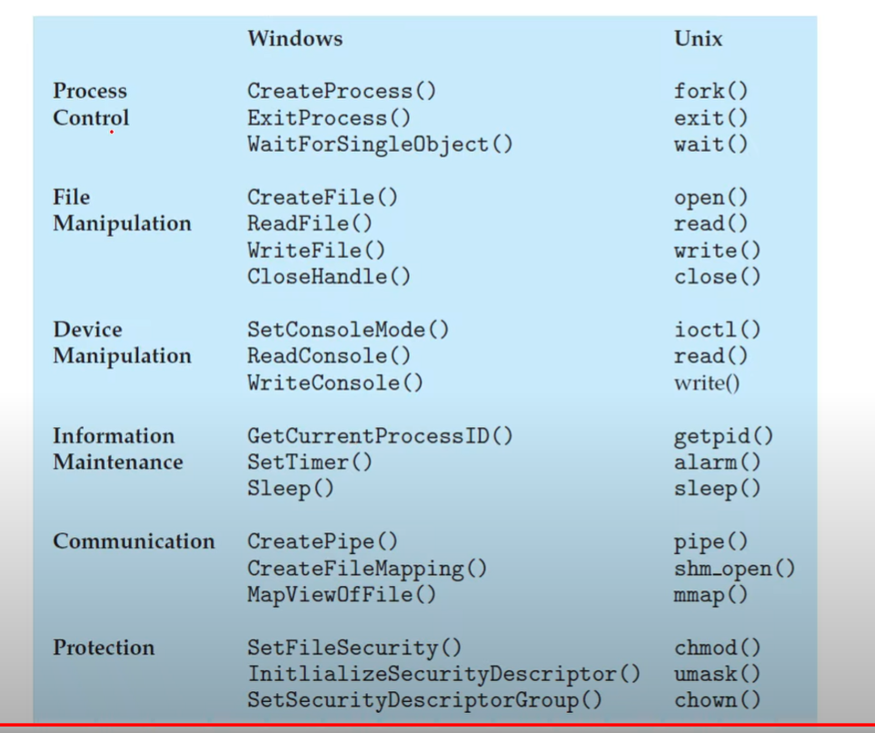